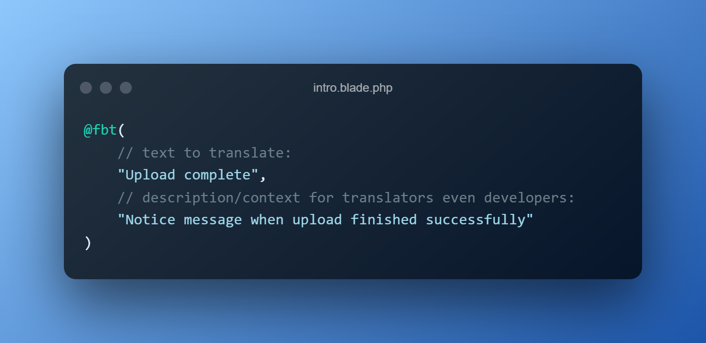
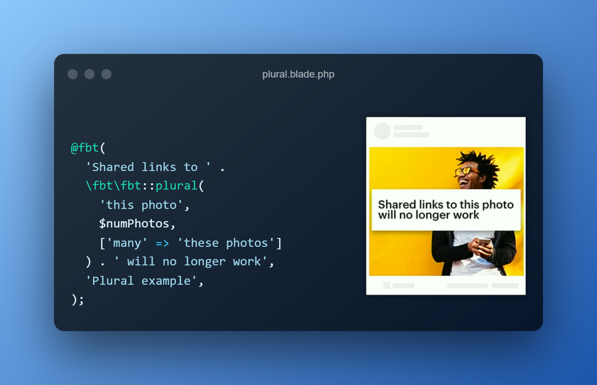
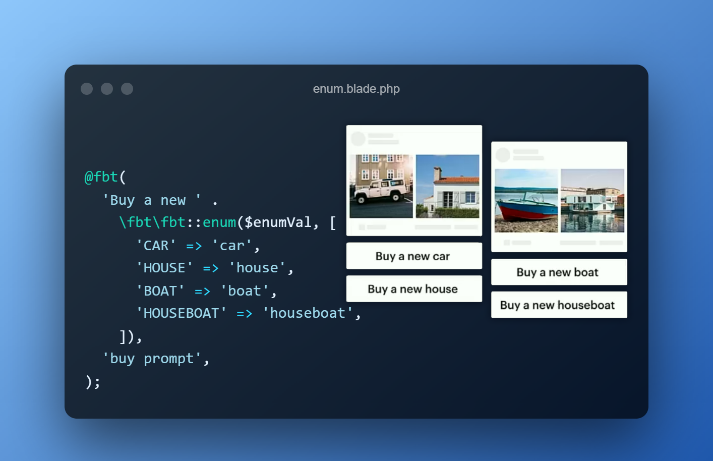
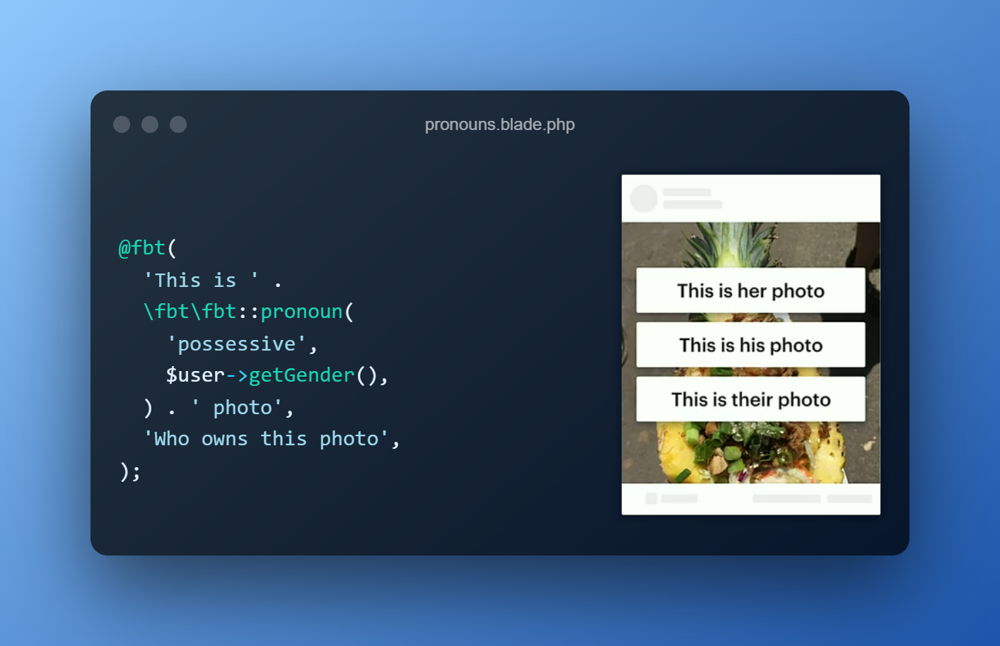

<h1 align="center">
  
</h1>

FBT is an internationalization framework for Laravel Application designed to be not just **powerful** and **flexible**, but also **simple** and **intuitive**.  It helps with the following:
* Organizing your source text for translation
* Composing grammatically correct translatable UI
* Eliminating verbose boilerplate for generating UI

**This library is based on the JavaScript implementation of Facebook's [FBT][link-facebook-fbt].**






## Requirements
* Laravel 5.5 or higher
* [Composer](https://getcomposer.org) is required for installation

## Installing

```shell
$ composer require richarddobron/laravel-fbt
```

## Getting started

[Integrating into your app](docs/getting_started.md)

## Version Guidance

| Version | Released   | Status     | Repo             | Laravel Version                          | PHP Version |
|---------|------------|------------|------------------|------------------------------------------|-------------|
| 3.x     | 2022-02-21 | Maintained | [v3][fbt-3-repo] | ^5.5                                     | ^7.0        |
| 4.x     | 2022-04-09 | Latest     | [v4][fbt-4-repo] | ^5.6\|^5.7\|^5.8\|^6.0\|^7.0\|^8.0\|^9.0 | ^7.2\|^8.0  |

## How FBT works
FBT works by transforming your `<fbt>` and `fbt(...)` constructs via
[Simple HTML DOM Parser][simplehtmldom].  This library serve to extract strings from source and
lookup translated payloads generated while execution.  FBT creates tables
of all possible variations for the given fbt phrase and accesses this
at runtime.

## Full documentation
https://github.com/richarddobron/laravel-fbt/tree/main/docs

## License
FBT is MIT licensed, as found in the [LICENSE](LICENSE) file.

[fbt-3-repo]: https://github.com/richarddobron/laravel-fbt/tree/3.x
[fbt-4-repo]: https://github.com/richarddobron/laravel-fbt
[link-facebook-fbt]: https://github.com/facebook/fbt
[simplehtmldom]: https://sourceforge.net/projects/simplehtmldom/files/simplehtmldom/1.9.1/
