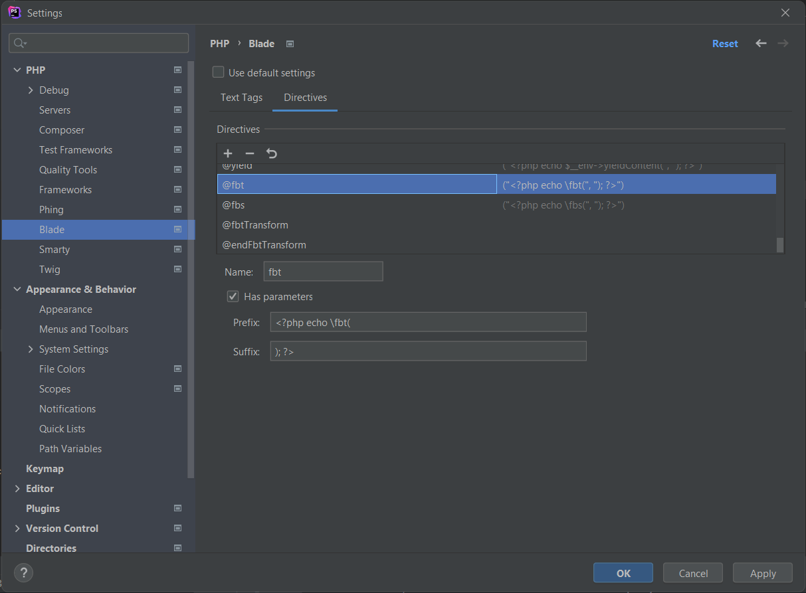

We recommend you read the [best practices](best_practices.md) for advice on how to best prepare your applications. We strongly encourage you to do so.

## 📦 Installing

```shell
$ composer require richarddobron/laravel-fbt
```
These steps are required:

1. Publish config file:
    - _We recommend setting the **author** and **project** options in /config/fbt.php._

```php
$ php artisan vendor:publish --provider="fbt\LaravelPackage\FbtServiceProvider" --tag=fbt-config
```

2. Run migrations:

```php
$ php artisan migrate
```

## 🔧 Configuration

### Options

The following options can be defined:

* **project** `string`: (Default: `website app`) Project to which the text belongs
* **author** `string`: Text author
* **preserveWhitespace** `bool`: (Default: `false`)
  - FBT normally consolidates whitespace down to one space (`' '`).
  - Turn this off by setting this to `true`
* **viewerContext** `string`: (Default: `\fbt\Runtime\Shared\IntlViewerContext::class`)
* **locale** `string`: (Default: `en_US`) User locale.
* **fbtCommon** `string`: (Default: `[]`) common string's, e.g. `[['text' => 'desc'], ...]`
* **fbtCommonPath** `string`: (Default: `null`) Path to the common string's module.

Below are the less important parameters.

* **logger** `bool`: (Default: `false`) Logging of string impressions.
* **collectFbt** `bool`: (Default: `true`) Collect fbt instances from the source and store them in a database or a JSON file.
* **hash_module** `string`: (Default: `md5`) Hash module.
* **md5_digest** `string`: (Default: `hex`) MD5 digest.
* **driver** `string`: (Default: `json`) Driver.
* **path** `string`: Cache storage path for generated translations & source strings.


## 	🙋 IntlInterface
Optional implementation of IntlInterface on User Model.

Example code:

```php
<?php

namespace App\Models\Auth;

use fbt\Transform\FbtTransform\Translate\IntlVariations;
use fbt\Lib\IntlViewerContextInterface;
use fbt\Runtime\Gender;

class User extends Authenticatable implements IntlViewerContextInterface
{
    public function getLocale(): string
    {
        return $this->locale;
    }

    public function getGender(): int
    {
        if ($this->gender === 'male') {
            return IntlVariations::GENDER_MALE;
        }

        if ($this->gender === 'female') {
            return IntlVariations::GENDER_FEMALE;
        }

        return IntlVariations::GENDER_UNKNOWN;
    }
}
```

**Note:** `auth()->user()` will be attached to `viewerContext` automatically.

## 	🚀 Artisan Commands

1. This command collects FBT strings across whole application in PHP files.
```shell
php artisan fbt:collect-fbts
```
Read more about [FBTs extracting](collection.md).

2. This command generates the missing translation hashes from collected source strings.
```shell
php artisan fbt:generate-translations
```

3. This command creates translation payloads stored in database/JSON file.
```shell
php artisan fbt:translate
```
Read more about [translating](translating.md).

## 📘 API

- [fbt(...);](api_intro.md)
- [fbt::param(...);](params.md)
- [fbt::enum(...);](enums.md)
- [fbt::name(...);](params.md)
- [fbt::plural(...);](plurals.md)
- [fbt::pronoun(...);](pronouns.md)
- [fbt::sameParam(...);](params.md)
- [fbt::c(...);](common.md)

```php
echo fbt('You just friended ' . \fbt\fbt::name('name', 'Sarah', 2 /* gender */), 'names');
```

## 🎨 Blade Directives

### @fbtTransform & @endFbtTransform
**@fbtTransform**: _This directive will turn output buffering on. While output buffering is active no output is sent from the script (other than headers), instead the output is stored in an internal buffer._

**@endFbtTransform**: _This directive will send the contents of the topmost output buffer (if any) and turn this output buffer off._

```php
@fbtTransform
   ...
   <fbt desc="auto-wrap example">
     Go on an
     <a href="#">
       <span>awesome</span> vacation
     </a>
   </fbt>
   ...
@endFbtTransform

// result: Go on an <a href="#"><span>awesome</span> vacation</a>
```

### @fbt

```php
@fbt(
 [
  'Go on an ',
  \fbt\createElement('a', \fbt\createElement('span', 'awesome'), ['href' => '#']),
  ' vacation',
 ],
 'It\'s simple',
 ['project' => "foo"]
)

// result: Go on an <a href="#"><span>awesome</span> vacation</a>
```

```php
@fbt('You just friended ' . \fbt\fbt::name('name', 'Sarah', 2 /* gender */), 'names')

// result: You just friended Sarah
```

```php
@fbt('A simple string', 'It\'s simple', ['project' => "foo"])

// result: A simple string
```

### Encoding in Blade
using `\fbt\LaravelPackage\fbt` function
```php
$htmlText = \fbt\LaravelPackage\fbt('<strong>STRONG</strong> text', 'HTML text');

{{ $htmlText }}
// result: <strong>STRONG</strong> text

{!! $htmlText !!}
// result: <strong>STRONG</strong> text
```

using `\fbt` function
```php
$htmlText = \fbt('<strong>STRONG</strong> text', 'HTML text');

{{ $htmlText }}
// result: &amp;lt;strong&amp;gt;STRONG&amp;lt;/strong&amp;gt; text

{!! $htmlText !!}
// result: <strong>STRONG</strong> text
```

### PhpStorm integration

The PhpStorm IDE can recognize the custom Blade directive if is set in *File > Settings > Languages & Frameworks > PHP >
Blade > Directives* by adding a new one with the following properties:

* Name: fbt
* Has parameters: yes
* Prefix: `<?php echo \fbt(`
* Suffix: `); ?>`


* Name: fbs
* Has parameters: yes
* Prefix: `<?php echo \fbs(`
* Suffix: `); ?>`


* Name: fbtTransform
* Has parameters: no


* Name: endFbtTransform
* Has parameters: no


