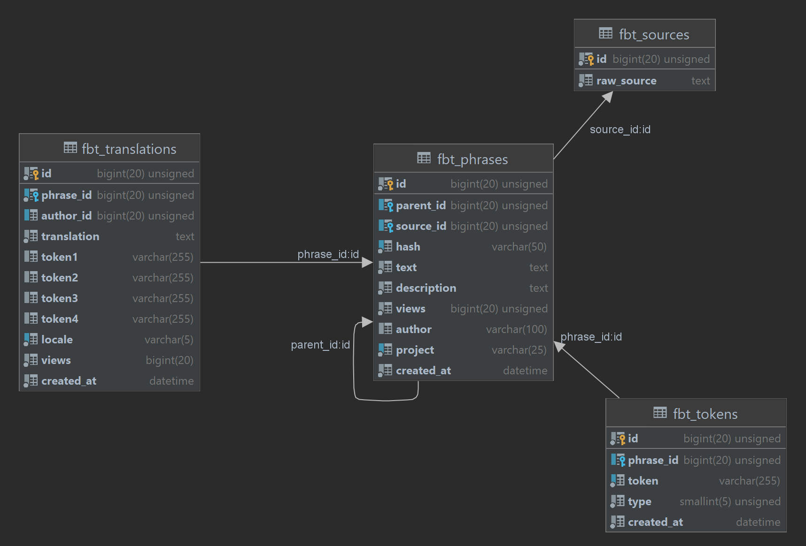
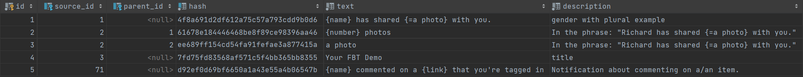
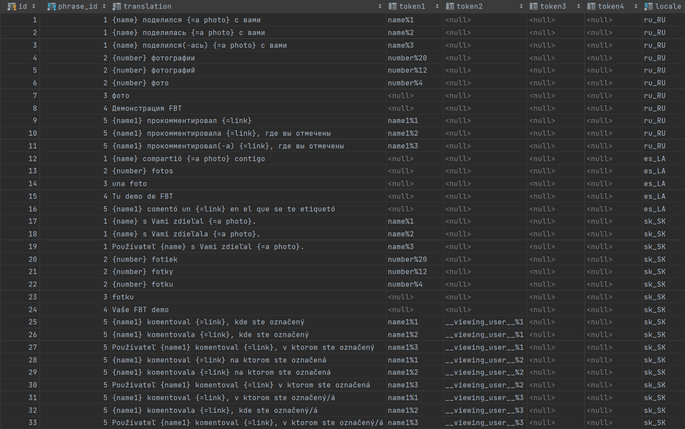

# Translating

There are two ways to translate phrases:
1. Manually translate generated JSON file by `php artisan fbt:generate-translations` and then use the `php artisan fbt:translate` command.
2. Manually add translations to the database and then use the `php artisan fbt:translate` command.
3. Use the app editor [Swiftyper Translations](https://github.com/swiftyper-sk/laravel-fbt-sync).

## Command to generate missing translation hashes from collected source strings:
**⚠️ NOTE: This command is required only if you are using `json` driver.**

```shell
php artisan fbt:generate-translations --translation-input=./storage/fbt/translation_input.json
# or
php artisan fbt:generate-translations --translations=./storage/fbt/translations/*.json
```

### Options:
| name                    | default                                         | description                                                                                               |
|-------------------------|-------------------------------------------------|-----------------------------------------------------------------------------------------------------------|
| --src                   | `FbtConfig::get('path')`/.source_strings.json   | Path to collected source strings file                                                                     |
| --translation-input     | `FbtConfig::get('path')`/translation_input.json | Path to translation input file                                                                            |
| --translations=`[path]` | *none*                                          | The translation files containing translations.<br>E.g. `--translations=./storage/fbt/translations/*.json` |

## Artisan command to convert provided translations to jenkins:
```shell
php artisan fbt:translate
# or
php artisan fbt:translate --stdin < translation_input.json
# or
php artisan fbt:translate --translations=./storage/fbt/translations/*.json
```

### Options:
| name                             | default | description                                                                                                                                                               |
|----------------------------------|---------|---------------------------------------------------------------------------------------------------------------------------------------------------------------------------|
| --pretty                         | no      | Pretty print the translation output                                                                                                                                       |
| --translations=`[path]`          | *none*  | The translation files containing translations.  If not specified, the translations are retrieved from the database.<br>E.g. `--translations=/path/to/translations/*.json` |
| --stdin < translation_input.json | *none*  | Instead of reading translation files and source file separately, read monolithic JSON file from STDIN                                                                     |

## JSON schema:

In addition to the below example, the `translation_input.json`
provided in our [tests](https://github.com/richardDobron/fbt/blob/main/tests/translations/stdin-data/translation_input.json)
is a good reference on the "schema" used for the translations.

```json
{
  "phrases": [
    "hashToText": {
      <text_hash>: <text>,
      ...
    },
    "jsfbt": string|{t:<table>, m:<metadata>}
  ],
  ...
  "translationGroups": [{
    "fb-locale": "xx_XX",
    "translations": {
      <translation_hash>: {
        "tokens": [<token1>, ..., <tokenN>],
        "types": [<variationType1>, ..., <variationTypeN>]
        "translations": [{
            "translation": <translation1>,
            "variations": [variationValue1,...,variationValueN]
          },
          ...,
        ]
      }
    }
  }]
}
```

The `<text_hash>` and `<translation_hash>` correspond in the above example.
That is `translations[<hash>]` is the translation entry for
`phrases.hashToText[<hash>]`.

Here `tokens`, `types` and `variations` are all associative arrays.  That is, in
the above example, `types[i]` represents the variation type (or mask) of
`tokens[i]` and `variations[i]` is the variation value of `token[i]` for the
given translation entry.

## Database schema:



## Example translation:
### fbt_phrases



### translations
If you use tokens, they must be defined in same order and the following form: `token_name`%`token_type`.


...

## Variation types
Variation types can be one of
```
IntlVariations::BITMASK_NUMBER: 28
IntlVariations::BITMASK_GENDER:  3
```
This signifies what the given token can variate on.  Token types of type `GENDER` can be:
```
IntlVariations::GENDER_MALE:    1
IntlVariations::GENDER_FEMALE:  2
IntlVariations::GENDER_UNKNOWN: 3
```
while token types of `NUMBER` can be:
```

IntlVariations::NUMBER_ONE:    4
IntlVariations::NUMBER_TWO:    8
IntlVariations::NUMBER_MANY:  12
IntlVariations::NUMBER_ZERO:  16
IntlVariations::NUMBER_FEW:   20
IntlVariations::NUMBER_OTHER: 24
```
